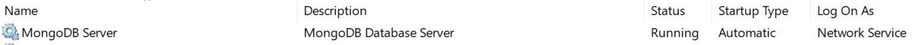
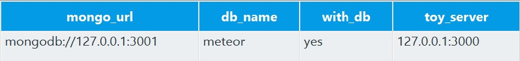

# effort-server

EFFORT experiment server to be run with the companion OpenSesame experiment.

## Server

### Installation

1. Open a command prompt or powershell with administrator privileges. An easy way to do this is to open Windows search (or simply press the windows key on your keyboard) and type `powershell`. Right-click on the powershell icon and choose 'Run as Administrator' from the drop-down menu.
2. Install chocolatey following the [instructions on its webpage](https://chocolatey.org/install).
3. Install Meteor with the command `cinst meteor -y`. Wait till the installation is finished.
4. Close the administrator terminal and open a new one, but this time not as administrator.
5. Clone this repository to your local machine using git, or download it using the green download button at the top right of this page.
6. In your powershell, navigate to the folder to which you just cloned or extracted the repository. An easy way to do this, is to find the relevant folder in Windows Explorer. Then right-click on the folder, while holding down the `shift` key. In the context menu that opens, click `Open PowerShell window here`.
7. Execute the command `meteor npm ci` to install dependency packages.

### Starting the server

From the folder in which the repository is located, type `meteor`. The first run can take a while to begin, but after that startup should be swift. You can then watch the server in action by opening a browser and navigating to [http://localhost:3000](http://localhost:3000).

## Installing MongoDB

MongoDB is the database that Meteor uses to operate. Meteor comes included with its own version of MongoDB, but sadly this version cannot be accessed from outside of the computer that meteor (or the effor-server) is running on. We do require this, as all te computers running the effort experiment need to communicate directly with MongoDB over the network.

To make this work, we thus need to install MongoDB separately and configure meteor, or the effort-server, to use this MongoDB instead of the one it comes bundled with. Installing MongoDB is very easy if you have chocolatey installed. Open an _Administrator_ PowerShell and execute the command:

```powershell
cinst mongodb -y
```

This only installs MongoDB to the system, but we still need to activate it. Use powershell to go to the directory in which MongoDB is installed. By default, Chocolatey installs MongoDB to `C:\Program Files\MongoDB\Server\4.2\bin\mongod`. The `4.2` may be different depending on the version of MongoDB that has been installed, so check for this if you run into problems with the following steps. To change to the directory of the MongoDB install, execute

```powershell
cd C:\Program Files\MongoDB\Server\4.2\bin\
```

This folders houses all command line programs associated with MongoDB. Let's install MongoDB as a service, so it will automatically start when Windows starts. Make sure you are in the right folder (you can always check your current folder with the command `pwd`). In this folder, execute the command:

```powershell
.\mongod --directoryperdb --install --logpath C:\ProgramData\MongoDB\log\mongod.log --dbpath C:\ProgramData\MongoDB\data\db
```

Remember to do this all in a PowerShell window that has Administrator permissions. Once this command is finished, MongoDB should be installed as a Windows Service. You can check this by searching for `Services` in the Windows start menu. By opening the desktop app that is (hopefully) found, you get to see an alphabetically sorted list of all services that are currently registered in your Windows installation. Scroll down to M for MongoDB and check if you see the following entry:



If the status column displays contains `Running`, MongoDB is now running on your system, and will start whenever Windows starts!

### Making sure MongoDB is accessible from outside

By default, MongoDB itself is also not accessible from outside due to security reasons. Since the effort experiment does not really run the risk of exposing sensitive data to the outside world, we are not going to bother with creating user accounts, and are just going to make MongoDB listen to connections from the outside network.

In the `cd C:\Program Files\MongoDB\Server\4.2\bin\` folder open up the file `mongod.cfg` in your favorite text editor, and find the line:

```text
  bindIp: 127.0.0.1
```

Change this to

```text
  bindIp: 0.0.0.0
```

to allow access from outside. To make this setting in effect, we have to restart MongoDB. Execute these commands in succession in your opened PowerShell:

```powershell
net stop MongoDB
net start MongoDB
```

You have restarted the MongoDB service and in effect loaded the new settings. If all went well you should see the message:

```powershell
The MongoDB Server service is starting.
The MongoDB Server service was started successfully.
```

### Connecting effort-server to external MongoDB

The effort-server folder also contains a file called `run.bat`. This file is configured to start effort-server and make it look for a MongoDB instance running on the *same* computer. You can run execute this file from PowerShell by running `run.bat`, or by double-clicking it in Windows Explorer.

If you have MongoDB running on a different PC than the effort server, open `run.bat` with your favorite text editor, and change the value of `MONGO_URL` so that it points the server on which your MongoDB is running. Most likely you only have to change the IP address from `127.0.0.1` to the one of the other computer on which MongoDB is running, and can keep the rest the same.

<!-- ### Creating the effort database in MongoDB

Now MongoDB is running, we have to create a container in which the effort server can place its data. This container is called a database (I know, this gets quite confusing as MongoDB is called a database itself too). To do this, execute the command `.\mongo.exe` from the PowerShell window that you still have opened at the MongoDB folder. -->

## Client

### Connecting OpenSesame to the server

OpenSesame requires some extra modules to be able to interact with the server, but these should be installed automatically on the first run of the experiment. If automatic installation fails for some reason, please also try to see if it succeeds when OpenSesame is run in Administrator mode.

### Configuring connection parameters

In the item `SessionSettings` in the EFFORT experiment, you can enter the IP address and port of both the computer running MongoDB and the effort-server. Usually, this is one and the same computer, unless you have chosen to install MongoDB on a different machine than the one you are running the effort server on.



In the screenshot above, the IP address `127.0.0.1` is used, which commonly refers to the computer you are working on, or the 'localhost'. If you run meteor on the same computer as you start the experiment on, the default setting work out-of-the-box. More likely, the server runs on a different computer, and you need to adjust the IP addresses (and if necessary to port suffix, which can be found after the colon (:)) to the right ones.

- *mongo_url*: The IP address and port on which the Mongo server is running. The default port when running the Mongo version that is included with Meteor is `3001`. The default port that is used by  external MongoDB installations is `27017`.
- *db_name*: The name of the database in MongoDB. When Mongo is run from Meteor, this is usually simply called 'meteor'. For external MongoDB installations, this is `effort` (because of the last part of the MONGO_URL in `run.bat`, which is `/effort`, and constitutes the database name to use.)
- *with_db*: `yes` if the experiment should attempt to connect to the database, `no` if it should run without the database (for testing purposes).
- *toy_server*: The IP address and port on which the toy selection server can be found (which is part of the Meteor app that also displays the sessions and leaderboard). Usually this is the same as the IP address specified in `mongo_url`, only the port is different (`3000`)

If these settings are configured correctly, the EFFORT OpenSesame experiment should automatically connect to the server when it is run.

### Installing ChromeDriver

The EFFORT experiment uses a package called selenium (which is installed automatically at the first start of the experiment) to fire up an instance of Chrome for the toy selection screen. To do so, it requires a correct ChromeDriver to be installed. Download the chrome driver with the version matching your Chrome from [https://chromedriver.chromium.org/](https://chromedriver.chromium.org/). You can check your Chrome version by opening the browser menu through the three vertical dots at the top-right of the browser window, and then selecting the following menu items in Chrome `Help > About Google Chrome`.

Once you have downloaded an appropriate version of the ChromeDriver, you should extract the zip and move or copy the resulting `Chromedriver.exe` to a location in your [system's PATH](https://en.wikipedia.org/wiki/PATH_(variable)). You can find out which folders this are by opening a powershell and executing

```powershell
$env:path -split ";"
```

This will print a list of all the locations that are in your path. It is recommendable to use a path location that is inside your user dir, or home folder (this can be determined by executing the command.

```powershell
$HOME
```

in powershell). Once you have copied the ChromeDriver to this location, OpenSesame should be able to open a Chrome window on its own. You can check if ChromeDriver is correctly placed in your path, by executing the command `ChromeDriver.exe` in any folder in PowerShell but the one in which you just copied ChromeDriver.

## In case of problems

Firewalls can be a real culprit in these kind of networked applications. Some firewalls just silently block everything, causing connections to fail without notifying you why. If you have trouble getting OpenSesame connected to Meteor or MongoDB, try to shutdown *all* firewall applications first and try again.
